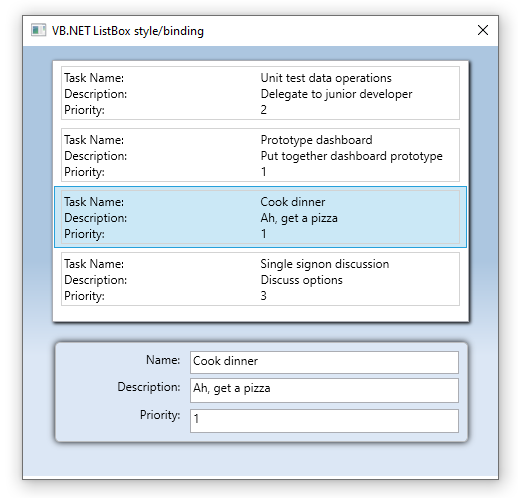

# WPF ListBox style and binding 
Provides examples for displaying columnized information in a ListBox in C# and Visual Basic.

### About
Code samples are based off Microsoft docs, [Data Templating Overview](https://docs.microsoft.com/en-us/dotnet/framework/wpf/data/data-templating-overview) were in a DataTemplate is used to provide a view to task in two columns while this code sample expands on the original topic to include editing capabilities using a [ContentControl](https://docs.microsoft.com/en-us/uwp/api/windows.ui.xaml.controls.contentcontrol) designed with TextBlock and TextBox controls bound to the data in the ListBox.

Both projects have styles in app.xaml for C# and Application.xaml for Visual Basic.

---
[TechNet article location](https://social.technet.microsoft.com/wiki/contents/articles/53502.wpf-listbox-data-templatingstyling.aspx)

---

### NuGet packages
[JetBrains.Annotations](https://www.nuget.org/packages/JetBrains.Annotations) MIT license

